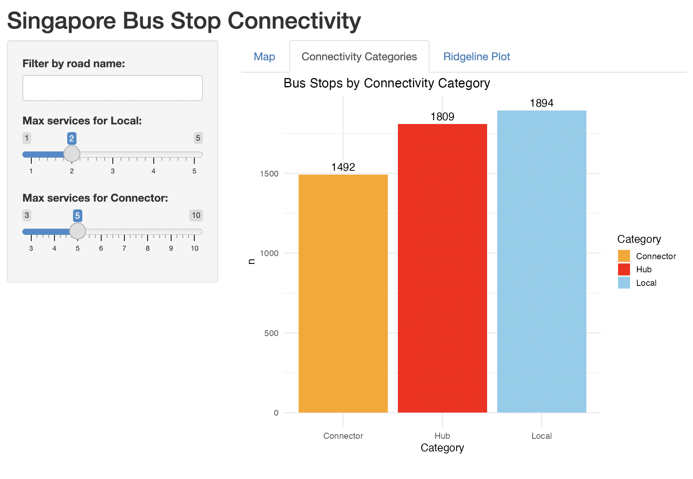

# Introduction

Singapore is widely regarded as one of the world’s most well-connected cities, with a highly developed public transport system that serves a population of over 6.11 million residents. The country’s public transport infrastructure is frequently cited as a key contributor to its economic efficiency and high quality of life. However, despite this reputation, local discourse often highlights disparities in accessibility across neighbourhoods, with particular concern surrounding newer housing estates such as Tengah which are perceived to have weaker transport links to the rest of the island.

While recent transport investments have focused heavily on the expansion of the rail network (ie. the Mass Rapid Transit system) , bus services continue to play a crucial role in residents' everyday commutes. This is especially important in an ageing society, where buses provide flexible, accessible transport options for residents who may be less able or willing to rely on rail-based travel. Bus routes also serve areas that are less densely populated or more peripheral, often described locally as “ulu,” where alternative transport options may be limited.

Against this backdrop, understanding the distribution of bus stops and their concentration across different roads offers valuable insight into patterns of accessibility and infrastructure provision within Singapore. By analysing publicly available bus stop data, this study explores how bus transport infrastructure is distributed across the city-state and examines whether connectivity appears evenly distributed or concentrated in specific areas.

# Part I-A Automated Data Collection

This study aims to explore patterns of transport connectivity in Singapore through the distribution of bus stops and routes.

Following the automated data collection decision framework, Public transport data were identified as highly relevant, particularly information on bus stop locations and bus routes published by the Land Transport Authority (LTA) of Singapore.

The next step in the decision tree considers whether an application programming interface (API) exists that provides structured access to the relevant database. In this case, the LTA offers an official API through the LTA DataMall, which provides comprehensive access to many different types of public transport data.

```{r}
#Load packages 
library(pacman)
pacman::p_load(httr, jsonlite, dplyr, ggplot2, purrr)
library(tidyverse)

#Define base URL
base_url <- "https://datamall2.mytransport.sg/ltaodataservice"

#Define access tokens 
API_KEY <- "aNXZQibBTGStKiyq3RGGiQ=="

#Correct endpoints
endpoint_busstop <- "/BusStops"
endpoint_busroute <- "/BusRoutes"

##For Bus Stops
#To get request 
get_busstops <- function(skip) { 
  url <- paste0(base_url, "/BusStops?$skip=", skip) 
  response <- GET( 
    url, 
    add_headers(AccountKey = API_KEY, accept = "application/json") ) 
  data <- content(response, as = "text", encoding = "UTF-8") %>% fromJSON(flatten = TRUE) 
  return(data$value) 
  } 

#Loop through pages (500 records per page) 
all_busstops <- map_dfr(seq(0, 60000, by = 500), get_busstops) 

#Inspect results 
glimpse(all_busstops)

##For Bus Routes 
get_busroutes <- function(skip) { 
  url <- paste0(base_url, "/BusRoutes?$skip=", skip) 
  response <- GET( 
    url, 
    add_headers(AccountKey = API_KEY, accept = "application/json") ) 
  data <- content(response, as = "text", encoding = "UTF-8") %>% fromJSON(flatten = TRUE) 
  return(data$value) 
} 

#Loop through pages (500 records per page) 
all_busroutes <- map_dfr(seq(0, 60000, by = 500), get_busroutes) 

#Inspect results 
glimpse(all_busroutes)
```

Each data set was cleaned and tidied prior to merging. The merge enables the integration of complementary information, geographic coordinates from the bus stop data and route structure details from the bus route data, producing a refined data set suitable for deeper analysis.

```{r}

#Data frame 
all_busstops  <- dplyr::bind_rows(all_busstops)
all_busroutes <- dplyr::bind_rows(all_busroutes)

class(all_busstops)
class(all_busroutes)


#Cleaning data for bus stops
bus_stops_clean <- all_busstops %>%
  mutate(
    BusStopCode = as.character(BusStopCode),
    RoadName = as.character(RoadName),
    Description = as.character(Description),
    Latitude = as.numeric(Latitude),
    Longitude = as.numeric(Longitude)
  ) %>%
  distinct() %>%
  filter(!is.na(Latitude), !is.na(Longitude))

#Cleaning data for bus routes
bus_routes_clean <- all_busroutes %>%
  mutate(
    ServiceNo = as.character(ServiceNo),
    Operator = as.character(Operator),
    Direction = as.integer(Direction),
    StopSequence = as.integer(StopSequence),
    BusStopCode  = as.character(BusStopCode),
    Distance = as.numeric(Distance)
  ) %>%
  distinct()

glimpse(bus_stops_clean)
glimpse(bus_routes_clean)
```

Due to the nature of the data, there were no missing variables. The two data sets were merged using the bus stop code variable, which is a unique number given to each bus stop.

```{r}
#To merge data sets 
routes_with_locations <- merge(
  bus_routes_clean,
  bus_stops_clean,
  by = "BusStopCode",
  all = FALSE
)
```

Save the refined data set for use in Shiny application.

```{r}
#Create a data folder
dir.create("data", showWarnings = FALSE)

#Save the data set
saveRDS(routes_with_locations, "data/routes_with_locations.rds")
```

# Part I-B Data Exploration and Contextualisation

The refined data set comprises two data sets: bus routes and bus stops, each offering distinct but complementary insights into Singapore’s public transport infrastructure. The bus routes dataset contains 26,538 observations across 12 variables, while the bus stops dataset includes 5,195 observations across 5 variables. In the bus routes data, each row represents a unique bus stop along a service route, with variables detailing the service route number (identifying the bus), operator (i.e., SBS Transit or Go-Ahead Singapore), the direction of the service, the sequence of the stop in the route, the bus stop code, the distance from the first stop of the route, and first and last bus timings for weekdays, Saturdays, and Sundays. The bus stops data set provides spatial and descriptive context for each stop, including the bus stop code, road name, description, longitude, and latitude.

This data source was selected for its rich potential in exploring questions of urban accessibility, equity, and infrastructure planning which are core concerns in the social sciences as it affects people's quality of life. By looking at these service routes and the spatial distribution of the bus stops, researchers can examine how transport connectivity varies across neighborhoods, which areas are underserved, and how public transit aligns with broader goals like social inclusion, access to job opportunities, and environmental sustainability.

# Part II-A Building an Interactive Dashboard with R Shiny

The interactive dashboard was designed to provide a multifaceted view of bus stop connectivity in Singapore, using the refined data set of bus routes and bus stops. Three visualisations were implemented in the Shiny dashboard to highlight different dimensions of connectivity.

### Visualisation 1 (Interactive Map) 

The interactive map plots each bus stop geographically, with bubble sizes proportional to the number of bus services available. Hence, the larger the bubble the more bus services available at that particular stop. Therefore, larger bubbles immediately signal highly connected stops, while smaller ones highlight areas with lower accessibility. This spatial representation makes disparities in public transport provision visible at a glance: dense clusters of large bubbles appear around central economic and tourism hubs such as the Central Business District, whereas smaller bubbles dominate more peripheral regions. The map also raises important social questions. In a city where a lack of housing has long been a problem, proximity to well‑connected train stations and bus stops is a crucial factor that shapes residents' quality of life as it affects commute times and cost. At the same time, the map illustrates the foresight of Singapore’s urban planning. Even in the “outskirts,” major bus interchanges are strategically distributed across the island, ensuring that connectivity is not confined to the just the Central Business District but is spread through regional hubs. Nonetheless, the map reveals pockets of relative under‑service, such as Bukit Timah and Tengah, where bus accessibility remains limited. The map was chosen because spatial representation is both intuitive and powerful, enabling users to connect service density with geography and to identify underserved regions that warrant closer policy attention.

### Visualisation 2 (Connectivity categories bar chart)



The connectivity categories bar chart provides a structural overview of the bus network by grouping stops into three categories: 'Local', 'Connector', and 'Hub'. These categories are defined by service count thresholds, which the user can adjust interactively via a slider toggle in the dashboard. This feature allows users to explore how different definitions of connectivity affect the overall distribution. In my configuration, stops with up to 2 services are classified as 'Local', those with 3 to 5 as 'Connectors', and anything above 5 as 'Hubs'. The output reveals that 1,894 stops fall into the 'Local' category, 1,492 are 'Connectors', and 1,809 are 'Hubs'. This distribution suggests a relatively even spread between lightly connected stops and major hubs, with 'Connectors' forming the smallest group. The high number of 'Local' stops suggests broad geographic coverage which is supported by the map in visualisation 1. Moreover, the near‑equal number of Hubs indicates that connectivity may be concentrated in key locations, reinforcing a degree of centralisation. At the same time, this pattern suggests that many commuters are close enough to major stops where multiple services converge, making it easier to catch a bus to one destination and then transfer to another. In practice, this means that people are not only connected to their immediate neighbourhoods but also have access to a wider network of travel options, such as trains, supporting flexibility and mobility across the island. The bar chart was chosen because it allows us to understand this complex relationship in an easier form, enabling meaningful discussion surrounding equity, efficiency, and the broader social implications of urban planning.

### Visualisation 3 (Ridgeline graph)

The ridgeline plot illustrates the distribution of bus service counts across selected roads, offering a nuanced view of how connectivity varies within the network. Each curve represents a road, with its shape showing the density of bus stops by number of services. Roads whose curves are shifted to the right host better‑connected stops, while those with peaks near the left are dominated by low‑service stops. Rather than plotting every road, which would overwhelm the visual, I designed the dashboard to let users choose which roads they want to compare. This makes the plot more focused and interpretable, while also allowing users to explore areas relevant to their own experience.

For my analysis, I selected Orchard Road, Jurong West Street 91, and Tengah Boulevard. Orchard Road was chosen for its centrality and dense transport infrastructure, it's curve shows multiple peaks extending up to 40 services, reflecting high accessibility to public buses. Jurong West Street 91 was a personal choice, as I grew up on that street and often experienced long commutes to town, typically requiring a bus‑to‑train transfer. Its curve peaks sharply around 0 to 5 services, confirming the limited direct bus connectivity I experienced. Tengah was included because of recent public complaints about poor transport access in the newly developed area. Interestingly, its curve peaks around 10 services, which is way more than Jurong West which is an arguably more "mature" estate. Suggesting that while some stops are moderately connected, the overall distribution remains narrow in comparison to places like Orchard Road.

The ridgeline plot was chosen because it exposes these contrasts, showing not just how many services exist, but how they are distributed across space.

# Part II-C Critical Engagement with AI: Copilot

Copilot’s contributions were most evident in several key moments. When my `mutate` call failed, Copilot suggested using `dplyr::bind_rows()` to combine data frames, which provided a practical workaround and helped me progress in my work.

It also guided me in choosing between file formats. While I initially preferred CSV for familiarity, Copilot recommended `.rds` to preserve R objects more faithfully. This advice pushed me beyond my comfort zone and allowed me to learn a new data format which was interesting to work with. It also helps to improve reproducibility, especially once I understood the differences between the two.

I was also having trouble regarding the app not loading due to R being unable to find the data set. Copilot’s explanation of `../data/routes_with_locations.rds` and the meaning of `..` as “go up one directory” was particularly insightful, as it allowed me to progress in my work and learn a new phrase in regards to file management.

Another valuable intervention came in the design of my dashboard. My ridgeline plot was initially too cramped because it attempted to display every road at once. The reactive filter was the part Copilot suggested.

```{df <- filtered_data()  # use reactive filter}
```

Copilot suggested restructuring the app so that users could select the roads they wanted to analyse. These refinements improved usability and readability, demonstrating Copilot’s strength in offering innovative problem‑solving approaches that enhanced the user experience.

Beyond code refinement, Copilot shaped my learning experience and confidence. While its suggestions were sometimes generic, they prompted me to think about how AI cannot replace the human aspect of the social sciences. While Copilot can refine code and suggest technical fixes, it cannot interpret lived experiences, contextual inequalities, or the values embedded in urban planning. Those dimensions require human judgment, empathy, and critical reflection.
